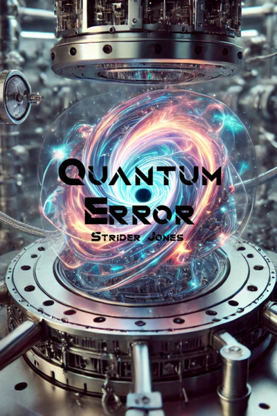

# Quantum Error



> **SPOILERS ABOUND!**
>
> This is the canonical mechanics bible for Quantum Error. It contains complete plot details, character arcs, abilities, and world-building notes. If you haven't read the story yet, **everything will be spoiled**.

Canon lives in Git Markdown; the wiki is a rendered view.

## Premise

Every culture ends up pondering one question as they advance far enough: Are we in a simulation? The simple answer is yes.

A group of programmers and scientists stumble upon an anomaly, granting them access to the keys of the universe. The story begins in the modern-day Bay Area and quickly transitions to a post-magic world with monsters, goblins, and dragons.

## Main Party

| Character | Class |
|-----------|-------|
| [Clint](characters/party/clint.md) | [Paladin of the System](classes/paladin-of-the-system.md) |
| [Vanessa](characters/party/vanessa.md) | [Quantum Sorceress](classes/quantum-sorceress.md) |
| [Rebekah](characters/party/rebekah.md) | [Temporal Bard](classes/temporal-bard.md) |
| [Selene](characters/party/selene.md) | [Veilstepper Rogue](classes/veilstepper-rogue.md) |
| [Wade](characters/party/wade.md) | [Cleric of Healing](classes/cleric-of-healing.md) |

## Quick Links

- [Character Roster](characters/roster.md)
- [Timeline](lore/timeline.md)
- [Chapter Summaries](story/chapter-summaries.md)
- [Canon Index](CANON.md)

## Workflow

```bash
# Validate canon
python tools/validate_canon.py

# Publish to wiki
python tools/publish_wiki.py
```
