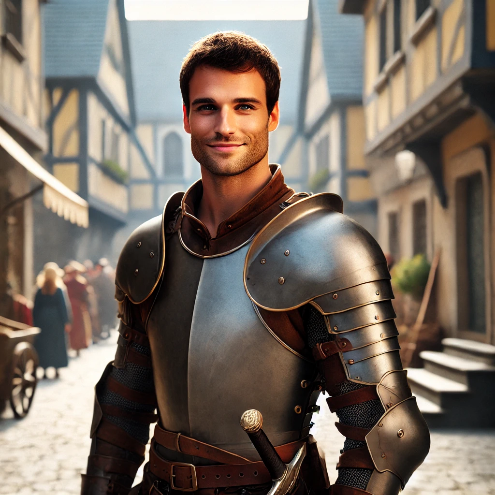

# Clint

| | |
|---|---|
| **Role** | Protagonist |
| **Pre-Transition Job** | Software Engineer |
| **Class** | Paladin of the System |
| **Age** | 32 |

Clint is a Computer Programmer for a top Quantum Computer company in the world. He volunteers as an EMT and considers himself a protector. He becomes a Paladin after the change.

Clint, a Utah native, possesses a sturdy and resolute demeanor. Standing tall with a robust build, he has a slightly tousled appearance, complementing his role as a leader. His fair complexion and light hair reflect the sun-kissed landscapes of his home state. Clint's eyes exude a blend of determination and warmth, mirroring the rugged yet welcoming spirit of Utah.

## Starting Stats

| Stat | Value |
|------|-------|
| Strength | 12 |
| Dexterity | 11 |
| Wisdom | 9 |
| Intelligence | 13 |
| Constitution | 11 |
| Charisma | 9 |
| Luck | 4 |

- Hit Points: 10
- Mana: 12
- Endurance: 9

## Modified Stats (Pre-Transition)

After boosting via the system console. Clint stopped boosting INT/WIS at 14 due to headaches, and forgot to boost his Luck entirely.

| Stat | Value |
|------|-------|
| Strength | 20 |
| Dexterity | 20 |
| Wisdom | 14 |
| Intelligence | 14 |
| Constitution | 20 |
| Charisma | 20 |
| Luck | 4 |

- Hit Points: 999
- Mana: 999

## Equipment

- [Aegis of Decoherent Deflection](../../items/armor/aegis-of-decoherent-deflection.md) — Legendary shield (lost at Transition, reclaimed)
- [Katsuragi, the Singularity Blade](../../items/weapons/katsuragi.md) — Legendary katana (lost at Transition, status unknown)
- [Fanny Pack of Holding](../../items/accessories/fanny-pack-of-holding.md) — Legendary bag of holding (soulbound, retained through death)

## Professions

- [Enchanting](../../professions/enchanting.md)
