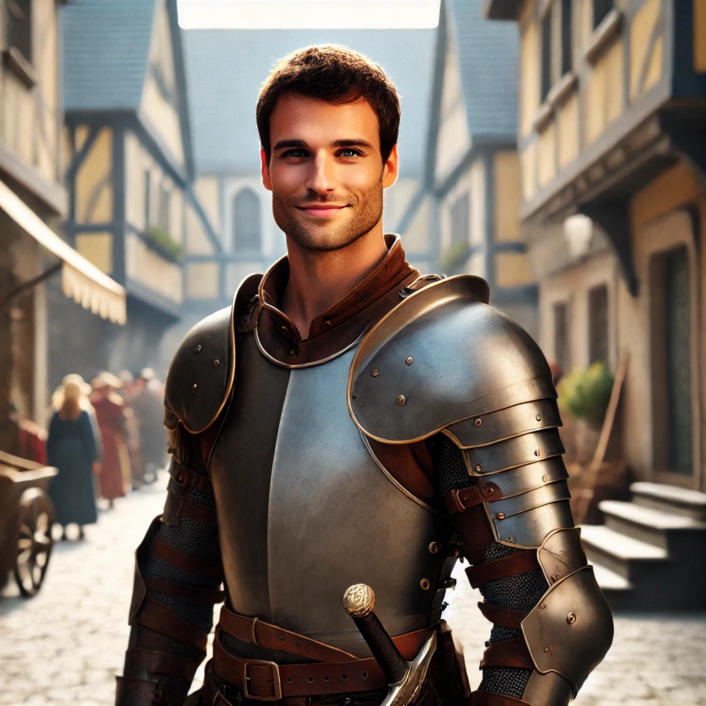

# Clint

| | |
|---|---|
| **Role** | Protagonist |
| **Full Name** | Clint (surname never stated) |
| **Race** | Human |
| **Age** | 32 |
| **Pre-Transition Job** | Software Engineer (iQuantum) |
| **Class** | [Paladin of the System](../../classes/paladin-of-the-system.md) |

Clint is a computer programmer for a top quantum computer company. He volunteers as an EMT and considers himself a protector — a role the System eventually makes official. He becomes a Paladin of the System after the Transition.

## Appearance

- **Height / build:** 6'2", broad-shouldered and robust — sturdy rather than sculpted.
- **Skin:** Fair; a few faint burn scars on his forearms (the shower incident, Ch 5).
- **Hair:** Short dark-blond, perpetually slightly tousled.
- **Eyes:** Steel-blue; his default expression blends determination and warmth.
- **Face:** Strong jaw, light stubble.
- **Signature kit (Spirit Dungeon arc):** the black [Fanny Pack of Holding](../../items/accessories/fanny-pack-of-holding.md) worn cross-body, [Mirror Shard](../../items/accessories/mirror-shards.md) pendant, prop machete with a faint white System-attunement glow. Costume comedy of the arc: pirate outfit (burned off by Vanessa's fireball, Ch 20) → [Stitched Burlap Cowl](../../items/armor/stitched-burlap-cowl.md) + [Singed Fedora](../../items/armor/singed-fedora.md).

### Epic Reflection (Mirror Room, Ch 18)

The restored mirrors showed each of them the self they're growing into. Clint's reflection wore **black plate mail with glowing purple sigils** — System script that brightens across the pauldrons and gauntlets as he moves — **his sword and shield glowing softly**. The sword seems to flicker at the edges, as if it can't settle on a single reality; the shield carries a faint hexagonal scale motif. *(A deliberate, subtle nod to [Katsuragi](../../items/weapons/katsuragi.md) and the [Aegis](../../items/armor/aegis-of-decoherent-deflection.md) — recognizable on reread, never named in prose.)* Everything in the glass had a deep power pulsing through it.

## Personality & Party Role

A Utah native with a sturdy, resolute demeanor — the friend who quietly takes responsibility when things go sideways. Party leader and tank. His protector instinct predates his class: the EMT volunteering, the D&D DMing, the reflex to put himself between the party and the problem. The System noticed.

## Vanessa

Clint and [Vanessa](vanessa.md) are not together, and Clint — who notices everything about everyone else's safety — has not noticed this. The protector reflex is party-wide, but it fires for her a half-beat sooner and he does not register the difference.

Because he is the POV, **the reader has to see this before he does.** He reports her reactions in more detail than anyone else's, quotes her more often, and reaches for her name first when the room goes bad. He never comments on it. Strider does — *"Now kiss."* (Ch 17) — and Clint deflects.

> **Author-only:** the cause is the [relationship leak](../../meta/real-world.md); see [Vanessa's entry](vanessa.md#clint) for the timeline dissonance. **Never on-page in Book 1** — and never in Clint's interiority, since his obliviousness is what keeps it deniable.

## Starting Stats

| Stat | Value |
|------|-------|
| Strength | 12 |
| Dexterity | 11 |
| Wisdom | 9 |
| Intelligence | 13 |
| Constitution | 11 |
| Charisma | 9 |
| Luck | 4 |

- Hit Points: 10
- Mana: 12
- Endurance: 9

## Modified Stats (Pre-Transition)

After boosting via the system console. Clint stopped boosting INT/WIS at 14 due to headaches, and forgot to boost his Luck entirely.

| Stat | Value |
|------|-------|
| Strength | 20 |
| Dexterity | 20 |
| Wisdom | 14 |
| Intelligence | 14 |
| Constitution | 20 |
| Charisma | 20 |
| Luck | 4 |

- Hit Points: 999
- Mana: 999

## Level & Progression

**Current (Ch 21):** **Level 4** [Paladin of the System](../../classes/paladin-of-the-system.md) — god: Strider · profession: [Enchanting](../../professions/enchanting.md) (console-era mastery) · proficiencies: Novice technique across the board (the [hacked-stats/Novice-hands gap](../../system/proficiencies.md)) — misses often against L10s, survives on stat pool.

| Ch | Event |
|----|-------|
| 4 | Class selected: Paladin (age-triggered; "Welcome, Holy Paladin") |
| 5 | Console-era spells: **Holy Light** · "Divine Strike" (early prose name for **Smite: Judgment**) · "Divine Touch" (tentatively = Cure Light Wounds — ⚠ unconfirmed) · **[Metamagic](../../magic/schools/metamagic.md)** (Legendary, "Mastered" — ✅ resolved: it's a school, he still holds the rank, and he has **zero** proficiency behind it, so he cannot use it at all) · Enchanting (Epic, "Mastered"). *Prose revision TODO: align Ch 5 spell names with class canon, incl. "Meta Magic" → **Metamagic**.* |
| 7 | **Identify** learned organically (by use, not console) |
| 8 | Console boosts: stats → 20s (INT/WIS 14); Perception "to master levels", Identification, Enchanting maxed; explicitly still Level 1 |
| 13–14 | XP-block revealed: *"You must align yourself with a God to activate your class"* — every kill since the start earned nothing; Strider's one-day blessing explained; newt curse; **Innate System** granted (interface-free) |
| 15 | **Class activated** (god: Strider) · Identify → **System Identify** · **Level 1 → 3** · one-time Complete Heal boon |
| 16 | **System Aura** unlocked · Smite: Judgement (Minor) mechanics shown ("This action is logged") · ⚠ duplicate Level-3 notification — Ch 15 already hit L3; one of the two should be L4 or be cut |
| 17 | Commanding Shout shown (threat-table mechanics) |
| 20 | **Level 3 → 4** (graveyard skeleton clear) · Shield Mastery + Shield Bash revealed — idle, no shield equipped |
| 21 | Smite: Sanction (L4 upgrade) first used in prose — block matches class canon |

## System Sense (Ch 14+)

From [Innate System](#level--progression) onward Clint has no interface. His system-sense is **synesthetic**: his own and his party's pools arrive as **color** (green / yellow / red for health; blue and amber by intensity for mana and endurance), passively, with the number available on request. Everything else — strangers, mobs, *which* debuff — is a manual inspect that returns a thin Book-1 read. Full rules and the prose convention ("color as sensation, never as a bar") in [System UI](../../system/ui.md#system-synesthesia-how-pools-feel); block formatting in [UI Popups](../../system/ui-popups.md).

## Patron: Strider

Clint's patron god, whose blessing activated his Paladin class ([Ch 15](#level--progression)).

**Strider's voice is audible to Clint alone.** The patron↔paladin bond is a private channel: Strider can speak to Clint, and **no one else in the party can hear him** — not [Vanessa](vanessa.md), [Rebekah](rebekah.md), [Selene](selene.md), or [Wade](wade.md). Anything the party learns from Strider, they learn because **Clint relays it** (or reacts to it). When Strider comments on someone else — needling Vanessa about a missed upgrade, say — it reaches her secondhand, through Clint.

**The relay works the other way, too.** Strider perceives the whole scene — including things Clint can't. When Clint is cut off from the party (the Spirit Dungeon's [zone lines](../../lore/dungeons/spirit-dungeon/rooms.md#zone-lines-section-barriers) seal sound between sections, so a launched Clint can *see* his teammates shouting but hear nothing), Strider becomes his only comms: he relays what the others are yelling — *paraphrased, editorialized, and quoted at his own leisure* (*"She said, and I quote, 'Use the mallet, you idiot.'"*). Useful and infuriating in equal measure; the relay is never neutral, and Strider withholds or slow-walks whatever amuses him.

> **Canon status (Ch 20):** current rule, deliberately narrow — one god, one listener. May widen later (other party members hearing him, or other gods speaking to their own faithful); until then, write Strider as a voice only Clint hears.

## Equipment & Inventory

Full history — where each item was found, given, or lost — lives in the [Inventory Ledger](../../story/inventory-ledger.md). Current loadout as of the Spirit Dungeon (Ch 18):

**Equipped**
- **Weapon:** Prop Machete — Common (4–7 phys), "still draws blood." Faint glow (System Attunement visual from L1 Smite).
- **Worn:** Pirate outfit (costume-rack, Common) + Singed Fedora.
- **Bag:** [Fanny Pack of Holding](../../items/accessories/fanny-pack-of-holding.md) — Legendary bag of holding (soulbound, retained through death).
- **Pendant:** [Mirror Shard](../../items/accessories/mirror-shards.md) — soulbound, earned in the Mirror Room.

**Carried (in the Fanny Pack)**
- Stashed costume stack ("for emergency use later").
- Robe of the Silent Scream — Common, +2 AR, now slashed across the chest (Bear Trap, Ch 17). Offered to Selene once he had the pirate outfit; she declined it as too revealing, so he stashed it, **promising to get it repaired for her** (a pending future beat).
- Live grenade ⏳ *old-world item; retcon / possible-MacGuffin undecided — see the ledger's [Open Threads](../../story/inventory-ledger.md#open-threads--needs-staging).*

### Unique Crafted Items (reclaimed at the finale)

Created before the Transition via [Enchanting](../../professions/enchanting.md) + system-console access. Both were lost when Clint died and now sit in the Ancient Red Dragon's hoard alongside the [Tablet of Annihilation](../../lore/tablet-of-annihilation.md) — **out of his hands until the series finale (L99).**

- [Katsuragi, the Singularity Blade](../../items/weapons/katsuragi.md) — Unique-tier katana (console exploit; outside the equipment framework).
- [Aegis of Decoherent Deflection](../../items/armor/aegis-of-decoherent-deflection.md) — Unique-tier shield (console exploit; outside the equipment framework).

## Professions

- [Enchanting](../../professions/enchanting.md)

## Connections

- **[Celeste](../supporting/celeste.md)** — San Francisco blacksmith, owner of Clayandsteel. Before the Transition, Clint took a run of her knifemaking and general forging classes. It never amounted to real proficiency — just enough to swing a hammer without embarrassing himself — but it's how the two of them became friends. Post-Transition, hers is one of the shops the party turns to for forged and enchanted gear.
