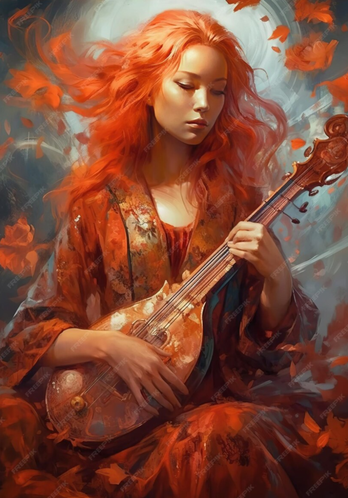

# Rebekah

| | |
|---|---|
| **Role** | Main Party |
| **Pre-Transition Job** | Recruiter |
| **Class** | Temporal Bard |
| **Age** | 26 |

Rebekah Sullivan is a recruiter who joins the group at the beginning due to mutual friendships. Once the conversion happens, she becomes a Temporal Bard.

Rebekah acts as a source of inspiration and hope when things start to look dark. Her magic will keep them moving forward and give significant buffs to the team.

Rebekah, a woman of 26, stands at 5'8" with an arresting presence accentuated by her fiery red hair cascading down her shoulders. Freckles adorn her fair skin, adding a touch of whimsy to her appearance. Her Scottish heritage is evident in the lilt of her voice, echoing the rolling hills of her ancestral home.

## Modified Stats (Pre-Transition)

After boosting via the system console.

| Stat | Value |
|------|-------|
| Strength | 20 |
| Dexterity | 20 |
| Wisdom | 20 |
| Intelligence | 20 |
| Constitution | 20 |
| Charisma | 20 |
| Luck | 10 |

- Base Luck: 7 (boosted to 10, kept it there)
- Hit Points: 999
- Mana: 999
