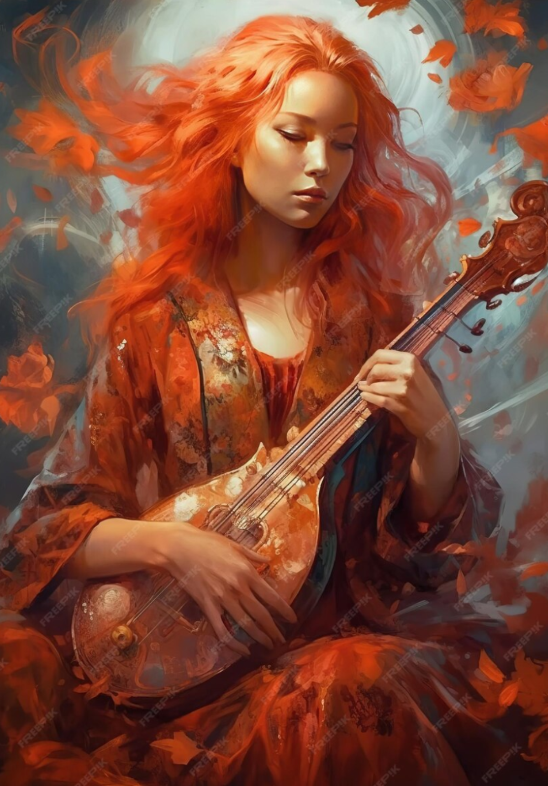

# Rebekah

| | |
|---|---|
| **Role** | Main Party |
| **Full Name** | Rebekah Sullivan |
| **Race** | Human |
| **Age** | 26 |
| **Pre-Transition Job** | Recruiter |
| **Class** | [Temporal Bard](../../classes/temporal-bard.md) |

Rebekah Sullivan is a recruiter who joined the group through mutual friendships rather than through iQuantum. After the Transition she becomes a Temporal Bard — the party's buffer, morale engine, and source of hope when things look dark.

## Appearance

- **Height / build:** 5'8", a comfortable, sturdy-soft build; an arresting, warm presence.
- **Skin:** Fair, with freckles across her face — a touch of whimsy.
- **Hair:** Fiery red, worn loose and very long — it falls nearly to her waist ("nearly to the table" when she's seated, Ch 1).
- **Eyes:** Bright green; an open, expressive face.
- **Voice:** A soft Scottish lilt, echoing her ancestral heritage.
- **Attire:** practical layered travel clothes; [Mirror Shard](../../items/accessories/mirror-shards.md) pendant.
- **Illustration hook:** her hands — fingers mid-pluck on faintly shimmering vertical strings of light, a harp made of the moment itself (see [Playing Style](#playing-style)).

### Epic Reflection (Mirror Room, Ch 18)

Her future self wore **a beautiful dress** — deep green shot through with light-thread, glowing faintly like her strings — **and carried a guitar that looked half-medieval and half-futuristic**: a carved, lute-like body and scrollwork on one half, luminous fretwork with strings of hard light on the other. The instrument bridges the guitar she lost at the Transition and the temporal strings she plays now. Everything in the glass had a deep power pulsing through it.

## Personality & Party Role

The social fabric of the group — warm, loud, hopeful; the friend who pulls everyone to the table. In combat she's the force multiplier: her songs keep the party moving forward and grant significant buffs. When things look darkest, Rebekah is the reason they keep walking.

## Playing Style

Rebekah does not carry an instrument. [Chrono Resonance](../../classes/temporal-bard.md) lets her play *the temporal strings themselves* — she plucks at invisible threads of time while she sings, fingers moving as if on a harp no one else can see. The music comes from both her voice and the strings she's playing; the strings vibrate at frequencies most people can't hear but everyone can feel. When she's deep in a song, onlookers describe it as watching a harpist play an instrument made of the moment itself.

## Modified Stats (Pre-Transition)

After boosting via the system console.

| Stat | Value |
|------|-------|
| Strength | 20 |
| Dexterity | 20 |
| Wisdom | 20 |
| Intelligence | 20 |
| Constitution | 20 |
| Charisma | 20 |
| Luck | 10 |

- Base Luck: 7 (boosted to 10, kept it there)
- Hit Points: 999
- Mana: 999

## Level & Progression

**Current (Ch 20):** [Temporal Bard](../../classes/temporal-bard.md) — **level never stated in prose** (the only party member without one; an old chapter-17 review note claiming "L4" is unsupported). Kit has grown steadily even without level markers.

| Ch | Event |
|----|-------|
| 7 | Class selected: Bard — specialization explicitly deferred |
| 9 | **Veiled** passive shown (music makes people overlook the party) |
| 13 | **Haste** learned — first guitar-less cast; scales with "your temporal spell skill" (the story's first proficiency-style scaler) · death at the Transition |
| 14 | New songs: stamina-upkeep buffs, discordant trip-song |
| 16 | Haste song identified as **Temporal Boost** (advanced temporal reference frame; stacks "by increasing certainty, not speed") |
| 17 | **Dual-song weaving** gained (haste + evasion concurrently) |
| 18 | Kit named on-page: Dust Note, Dissonant Chord, Veil of Offbeats, **Harmonic Memory** · **Shard of Purpose** |
| 19 | Instrument-less temporal strings shown (Chrono Resonance on-page) |

## Equipment & Inventory

Full acquisition history in the [Inventory Ledger](../../story/inventory-ledger.md). Current loadout (Spirit Dungeon, Ch 18):

- **Instrument:** none — her physical guitar was destroyed by sniper fire during the Transition (Ch 13). She now plays the temporal strings themselves (see [Playing Style](#playing-style)).
- **Pendant:** [Mirror Shard](../../items/accessories/mirror-shards.md) — soulbound, earned outlasting her silencing guitar-echo.
