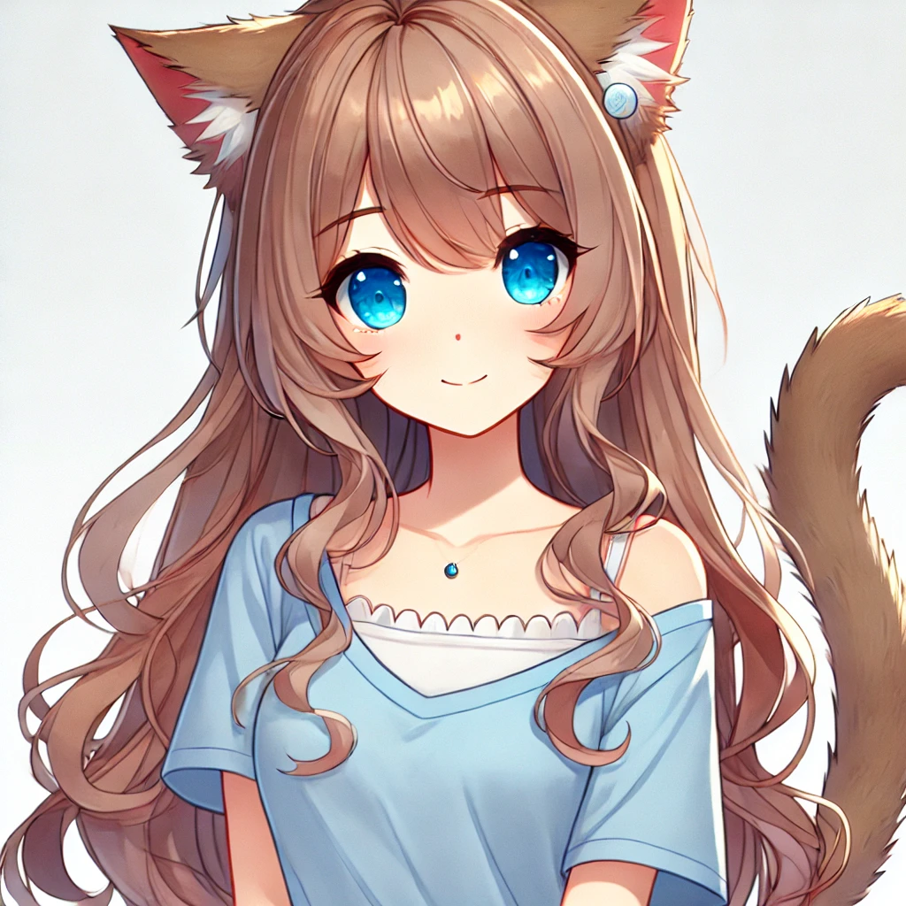

# Selene

| | |
|---|---|
| **Role** | Main Party |
| **Pre-Transition Job** | Lawyer (Chief Legal Officer) |
| **Class** | [Veilstepper Rogue](../../classes/veilstepper-rogue.md) |
| **Race** | [Nekara](../../races/nekara.md) |
| **Age** | 32 |

Selene Quell, a young woman with a playful demeanor, is characterized by her fair complexion and stringy blond hair that falls around her shoulders. Her features suggest a casual and carefree style, with an easygoing charm evident in her blue eyes. Selene's appearance, complemented by her slender build, gives her a relaxed and approachable vibe.

Selene is a Lawyer who becomes the Rogue of the group.

## Pre-Transition: Dustin

Before the transition, Selene was Dustin—a closeted trans woman who worked as iQuantum's Chief Legal Officer. Dustin stood just over 5 feet tall with stringy blond hair and blue eyes, and was described as "enthusiastically chipper."

The transition transformed her into a [Nekara](../../races/nekara.md) catgirl rogue, finally allowing her to live as her true self.

## Modified Stats (Pre-Transition)

After boosting via the system console.

| Stat | Value |
|------|-------|
| Strength | 20 |
| Dexterity | 20 |
| Wisdom | 20 |
| Intelligence | 20 |
| Constitution | 20 |
| Charisma | 20 |
| Luck | 15 |

- Base Luck: 9 (boosted to 15, highest in party—stopped due to "weird things" happening)
- Hit Points: 999
- Mana: 999
