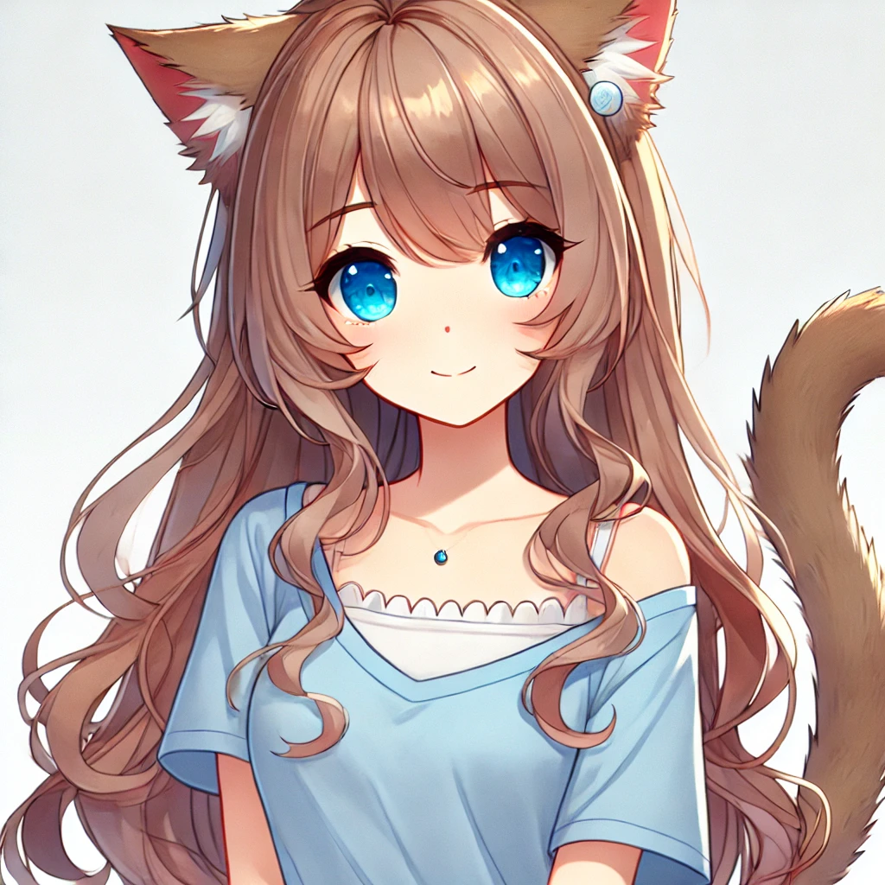
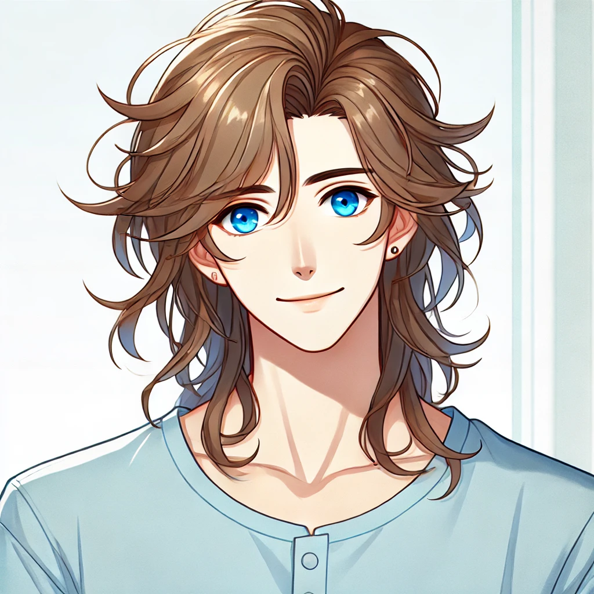

# Selene

| | |
|---|---|
| **Role** | Main Party |
| **Full Name** | Selene Quell |
| **Race** | [Nekara](../../races/nekara.md) |
| **Age** | 32 |
| **Pre-Transition Job** | Lawyer (Chief Legal Officer, iQuantum) |
| **Class** | [Veilstepper Rogue](../../classes/veilstepper-rogue.md) |

Selene Quell is the party's rogue — playful, carefree, and lethal from the shadows. Before the Transition she was Dustin, iQuantum's Chief Legal Officer; the Transition let her become who she always was.

## Appearance

- **Height / build:** Petite, about 5'1" — slender, with a frame noticeably slighter than Dustin's (canon: her echo's "frame broadens" when the mirror shifts back, Ch 18).
- **Skin:** Fair.
- **Nekara features (mostly-human end of the [spectrum](../../races/nekara.md#appearance)):** tawny-blond cat ears emerging from her hair; a long, expressive tail; vertical slit pupils in her blue eyes; small fangs when she grins. No body fur beyond the ears and tail.
- **Hair:** Blond, soft and full, falling around her shoulders. *("Stringy" was Dustin's word — the Transition gave her hair that matches the rest of her true self.)*
- **Eyes:** Blue, slit-pupiled, with an easygoing charm.
- **Attire:** casual, carefree style over her starting rogue clothes; [Mirror Shard](../../items/accessories/mirror-shards.md) pendant; [Qubit](../../items/accessories/mimic-pet.md), her pet mimic, usually trotting at her heel.

### Epic Reflection (Mirror Room, Ch 18)

In the group glimpse, her future self was **clad in shadows, making her hard to look at** — the eye slides off her. Her silhouette is the only crisp thing about her: ears and tail cut clean edges through the murk, and her slit-pupil eyes catch light from inside the dark. **In each hand, a wicked dagger pulsing with red energy** — the one color the shadow can't swallow. Everything in the glass had a deep power pulsing through it.

When she went back alone afterward ([Looking Again](../../lore/dungeons/spirit-dungeon/rooms.md#story-beat-looking-again)), the mirror showed her older, sharper, in full Epic-quality armor — a Nekara Veilstepper who has been doing this for a long time and is very good at it. The reflection did not shift. It did not become Dustin. It was just her, further along.

## Personality & Party Role

Playful demeanor, easygoing charm, and the party's sharpest situational awareness — sole member to detect the L10 Bear Trap, first to spot the prize-booth mimic. Scout, lockpick, and burst damage. Her pre-Transition legal mind still surfaces: she reads rules, contracts, and carnival economies the way she once read NDAs.

## Pre-Transition: Dustin

Before the transition, Selene was Dustin — a closeted trans woman who worked as iQuantum's Chief Legal Officer. Dustin stood just over 5 feet tall with stringy blond hair and blue eyes, and was described as "enthusiastically chipper." When Dan breached NDA to contact Eron Vosk, Dustin was the one who threatened him with legal action.

The transition transformed her into a [Nekara](../../races/nekara.md) catgirl rogue, finally allowing her to live as her true self.

## Modified Stats (Pre-Transition)

After boosting via the system console.

| Stat | Value |
|------|-------|
| Strength | 20 |
| Dexterity | 20 |
| Wisdom | 20 |
| Intelligence | 20 |
| Constitution | 20 |
| Charisma | 20 |
| Luck | 15 |

- Base Luck: 9 (boosted to 15, highest in party—stopped due to "weird things" happening)
- Hit Points: 999
- Mana: 999

## Level & Progression

**Current (Ch 20):** **Level 6** [Veilstepper Rogue](../../classes/veilstepper-rogue.md) ([Nekara](../../races/nekara.md)).

| Ch | Event |
|----|-------|
| 7 | Class selected: Rogue (as Dustin) · Stealth shown ("Backstabbed!") |
| 9 | Sheet: "Selene Quell … Female Nekara Rogue. Level 1" — name/sex/race console-set; Nekara transition slowed by the null-mana zone |
| 13 | Death at the Transition |
| 14 | **Level 6** (alongside Vanessa, coyote fights) |
| 16 | Sole party member to detect the L10 Bear Trap |
| 18 | Wins her echo duel under 2× Shaken · **Shard of Self** (soulbound, evolving) |
| 20 | Stealth pierced for the first time (Scarecrow of the Fallow Row) |

## Equipment & Inventory

Full acquisition history in the [Inventory Ledger](../../story/inventory-ledger.md). Current loadout (Spirit Dungeon, Ch 18):

- **Weapon:** Prop Cutlass — Common (5–8 slashing), "surprisingly sharp for plastic." Looted from the Sexy Pirate Mannequin.
- **Worn:** starting rogue clothes. Clint offered her his Robe of the Silent Scream once he had the pirate outfit, but she politely declined — the chest slash (from his bear-trap fall) leaves it too revealing. He stashed it instead, promising to get it repaired for her (a callback still to pay off). She may also pick up class-appropriate gear in the costume aisle.
- **Pendant:** [Mirror Shard](../../items/accessories/mirror-shards.md) — soulbound, earned facing her Dustin-echo.
- **Companion:** [Qubit](../../items/accessories/mimic-pet.md), the Prize Mimic — won honestly at the Carnival. A pet first, a container begrudgingly — and a kleptomaniac if unwatched.
