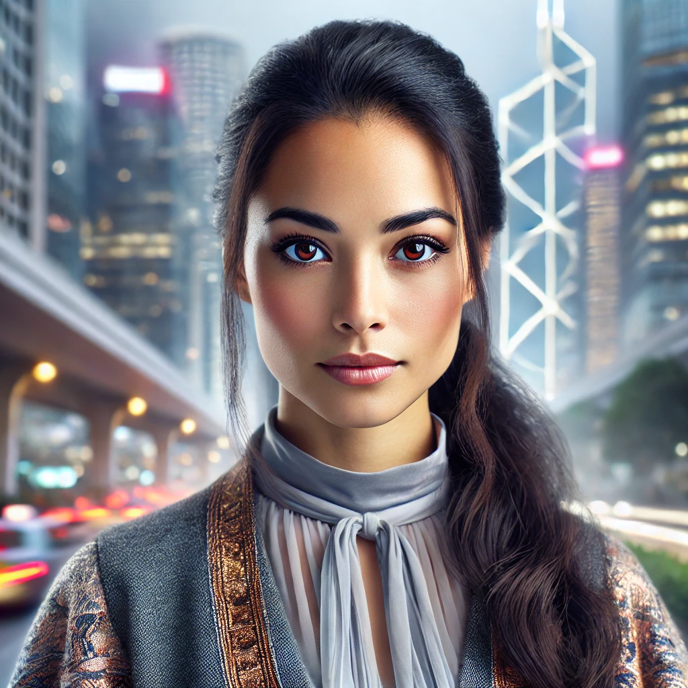

# Vanessa

| | |
|---|---|
| **Role** | Main Party |
| **Pre-Transition Job** | Quantum Physicist |
| **Class** | Quantum Sorceress |
| **Age** | 28 |

Vanessa Wong, hailing from the vibrant city of Hong Kong, is an Asian woman with a graceful and composed presence. She stands at an average height, her demeanor reflecting a blend of intellectual curiosity and mystical energy. Vanessa's features are distinguished by her Asian heritage, with captivating eyes that hold both analytical depth and a hint of magical wonder. Her attire is a seamless fusion of modern urban style and a touch of the fantastical, mirroring the dynamic energy of her cosmopolitan background.

After her Mana Shock, her eyes and veins glow softly with mana. The glow is mostly white, but will change toward the elemental color of the spell she is casting.

## Starting Stats

| Stat | Value |
|------|-------|
| Strength | 9 |
| Dexterity | 10 |
| Wisdom | 11 |
| Intelligence | 14 |
| Constitution | 10 |
| Charisma | 10 |
| Luck | 7 |

- Hit Points: 8
- Mana: 17
- Endurance: 8

## Modified Stats (Pre-Transition)

After boosting via the system console. Vanessa aimed for Intelligence 20.

| Stat | Value |
|------|-------|
| Strength | 20 |
| Dexterity | 20 |
| Wisdom | 20 |
| Intelligence | 20 |
| Constitution | 20 |
| Charisma | 20 |
| Luck | 7 |

- Luck: forgot to boost
- Hit Points: 999
- Mana: 9,999 (reduced from 99,999 after Mana Lucent incident)
