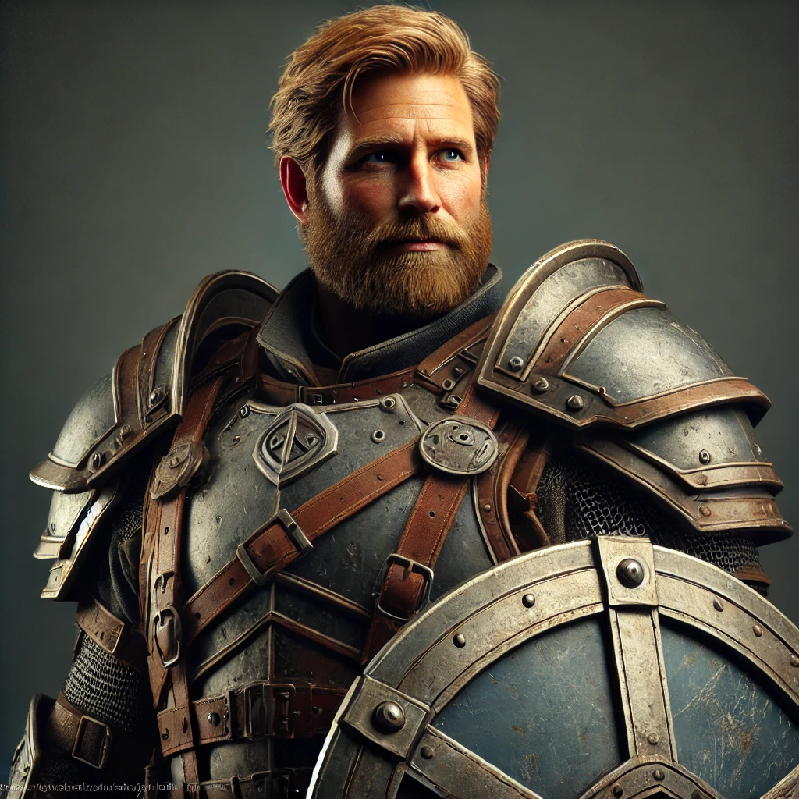

# Wade

| | |
|---|---|
| **Role** | Main Party |
| **Pre-Transition Job** | Software Manager |
| **Class** | [Cleric of Healing](../../classes/cleric-of-healing.md) |
| **Age** | 41 |

Wade Henning is [Clint's](clint.md) boss at iQuantum. A large man with a "dad-bod," sandy blond hair, and green eyes. He has drawings from his kids on his DM screen during D&D sessions.

## Modified Stats (Pre-Transition)

After boosting via the system console.

| Stat | Value |
|------|-------|
| Strength | 20 |
| Dexterity | 20 |
| Wisdom | 20 |
| Intelligence | 20 |
| Constitution | 20 |
| Charisma | 20 |
| Luck | 6 |

- Base Luck: 6 (not boosted)
- Hit Points: 999
- Mana: 999

## Family

- Wife: [Amanda](../supporting/amanda.md)
- Daughters: [The Twins](../supporting/the-twins.md)

Wade's motivation throughout Book I is protecting his family. His daughter's terminal illness drove the party to experiment with the system, and the capture of his wife and children by [Eron Vosk](../villains/eron-vosk.md) drives much of the plot.

## Post-Book I

After Eron's defeat and his family's reunion, Wade decides to step away from active adventuring. He has flashbacks of the "real world" and knows his daughters should have died. He refuses to be apart from them again.
