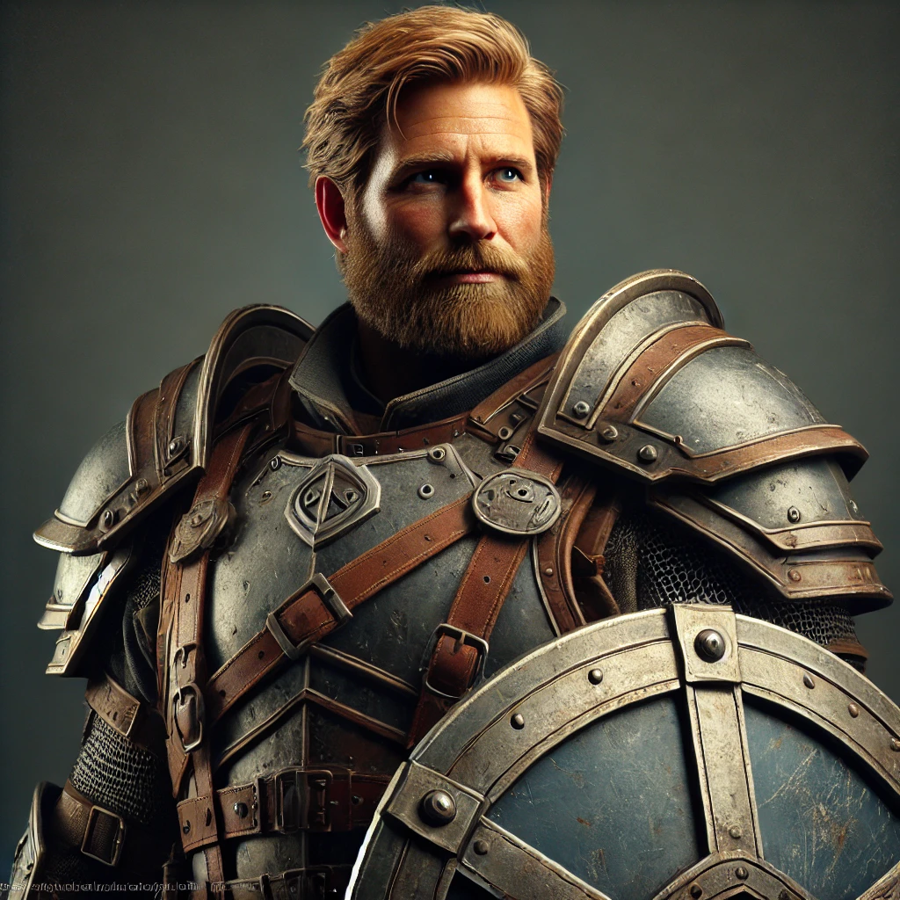

# Wade

| | |
|---|---|
| **Role** | Main Party |
| **Full Name** | Wade Henning |
| **Race** | Human |
| **Age** | 41 |
| **Pre-Transition Job** | Software Manager (iQuantum) |
| **Class** | [Cleric of Healing](../../classes/cleric-of-healing.md) |

Wade Henning is [Clint's](clint.md) boss at iQuantum and the DM of the D&D sessions where the anomaly was discovered. Family man, party healer, and the emotional center of the group.

## Appearance

- **Height / build:** A large man — 6'3", barrel-chested, soft in the middle: the canonical "dad-bod."
- **Skin:** Fair, weathered in a comfortable way.
- **Hair:** Sandy blond, short and slightly thinning; a trimmed sandy beard.
- **Eyes:** Green — tired but warm, with laugh lines. Visibly tired in the way parents of young kids are visibly tired.
- **Signature detail:** drawings from his kids taped to his DM screen (pre-Transition); post-Transition, the tiny **Nurse's Cap** (white, red cross) perched absurdly on his head. Looks ridiculous. He wears it anyway — it belongs in any party illustration.
- **Weapon:** none — his hands are usually lit mid-heal.

### Epic Reflection (Mirror Room, Ch 18) — denied

The glimpse of future selves was a shared scene — the four who won saw each other in the glass in epic gear. Wade got none of it: he [failed his echo](../../lore/dungeons/spirit-dungeon/mobs.md#wades-echo-the-empty-hands), and while the others stood transformed in the mirrors, Wade was on the floor, crying. The glass offered him no idealized self.

*(Author canon, unrevealed in prose: his mirror **does** hold one — the most radiant kit in the room. **White-and-gold vestment-plate that doesn't reflect light but *gives* it** — a steady dawn-glow with no visible source — a tall staff crowned by a slow-turning halo of System script, and healing light pooling at his feet with every step. Everyone else's reflection is armed; Wade's is what keeps them standing. It waits in the glass for a future Spirit Dungeon.)*

## Personality & Party Role

Large, warm, and steady — the healer in every sense. He DMs, he feeds people, he holds the group together, and his class formalized what he already was. His motivation is singular: his family. The party's willingness to follow him into terrible decisions (and out of them) is built on years of him doing the same for them.

## Modified Stats (Pre-Transition)

After boosting via the system console.

| Stat | Value |
|------|-------|
| Strength | 20 |
| Dexterity | 20 |
| Wisdom | 20 |
| Intelligence | 20 |
| Constitution | 20 |
| Charisma | 20 |
| Luck | 6 |

- Base Luck: 6 (not boosted)
- Hit Points: 999
- Mana: 999

## The Aura Wish

Wade's [Cleric Aura](../../classes/cleric-of-healing.md#cleric-aura) passively cleans everyone standing near him. He has never taken credit for it and doesn't really think of it as an ability — his magic looks after people as a side effect of him being in the room.

**Planted Ch 22.** He mentions the cleaning effect in passing while wondering whether he could fold [Rebekah's](rebekah.md) [Rejuvenation](../../classes/temporal-bard.md#rejuvenation) into the same aura — always on, covering everyone in range, nobody having to ask. Clint's answer does the work of establishing it: *"I wondered why I was still so clean. I assumed it was because Vanessa kept burning off my clothes."*

Naming it once is deliberate — the reader has to know the effect exists in order to feel it go missing when Wade does. **It should not come up again in Book 1.**

> **Author-only — this is the ending, said out loud in Book 1.**
>
> Wade is describing the thing he becomes. In the [series endgame](../../meta/real-world.md) he scans in permanently and his brain becomes the **substrate the simulation runs on** — continuous, ambient, sustaining everyone inside it, forever, without any of them having to ask. He wishes for it at a campfire around Level 6 and gets it in Book 5.
>
> **Do not underline it.** No lingering, no meaningful pause, no one else reacting. It should read as a healer complaining about his kit, and only become unbearable on a reread. See [[project_series_endgame]] and `meta/real-world.md`.

## Level & Progression

**Current (Ch 20):** **Level 6** [Cleric of Healing](../../classes/cleric-of-healing.md) · currently **Broken** (−3 all primary stats, −25% damage/healing/buffs; clears on Spirit Dungeon exit).

| Ch | Event |
|----|-------|
| 7 | Class selected: Cleric |
| 12 | Sheet shows **Level 3** pre-Transition — only party member above L1 before the reset; the leveling moment is never on-page (**open thread**) · Cleric Aura passive shown |
| 13 | Death at the Transition |
| 16 | **Level 6** revealed ("Wade's level six kick" — L4–6 gained off-page) · Blessed shown |
| 17 | Lesser Restoration · Cure Light Wounds (Empowered) variant |
| 18 | Failed his echo → **Broken** debuff; Shard of Devotion cracked unearned (re-attempt at a future Spirit Dungeon) |
| 20 | **Turn Undead** first shown (Risen Skeletons) |

## Equipment & Inventory

Full acquisition history in the [Inventory Ledger](../../story/inventory-ledger.md). Current loadout (Spirit Dungeon, Ch 18):

- **Weapon:** none carried — Wade heals rather than fights.
- **Accessory:** Nurse's Cap — Uncommon, +5% healing output. A tiny white cap with a red cross, looted from the Sexy Nurse Mannequin. Looks ridiculous on him. He wears it anyway.
- **Pendant:** none — Wade is the **only** party member who did *not* earn his [Mirror Shard](../../items/accessories/mirror-shards.md). He **failed his echo**, leaving him [Broken](../../system/effects.md) and the Shard of Devotion cracked and unclaimed. He gets another shot at a future Spirit Dungeon.

## Family

- Wife: [Amanda](../supporting/amanda.md)
- Daughters: [The Twins](../supporting/the-twins.md)

Wade's motivation throughout Book I is protecting his family. His daughters' terminal illness — **Sanfilippo syndrome (MPS III-A)**, see [The Twins](../supporting/the-twins.md) — drove the party to experiment with the system, and the capture of his wife and children by [Eron Vosk](../villains/eron-vosk.md) drives much of the plot.

The disease was killing both girls and erasing them as it went; in its late stages they no longer knew their own father. Healing them through the system did not just save their lives — it gave them back their *memories of him*. The first time in years his daughters looked up and **knew who he was** is the emotional core of Wade's arc. It is also why he cannot bear to be apart from them: he has already lived through becoming a stranger to his own children, and refuses to risk it again.

## Post-Book I

After Eron's defeat and his family's reunion, Wade decides to step away from active adventuring. He has flashbacks of the "real world" and knows his daughters should have died. He refuses to be apart from them again.
