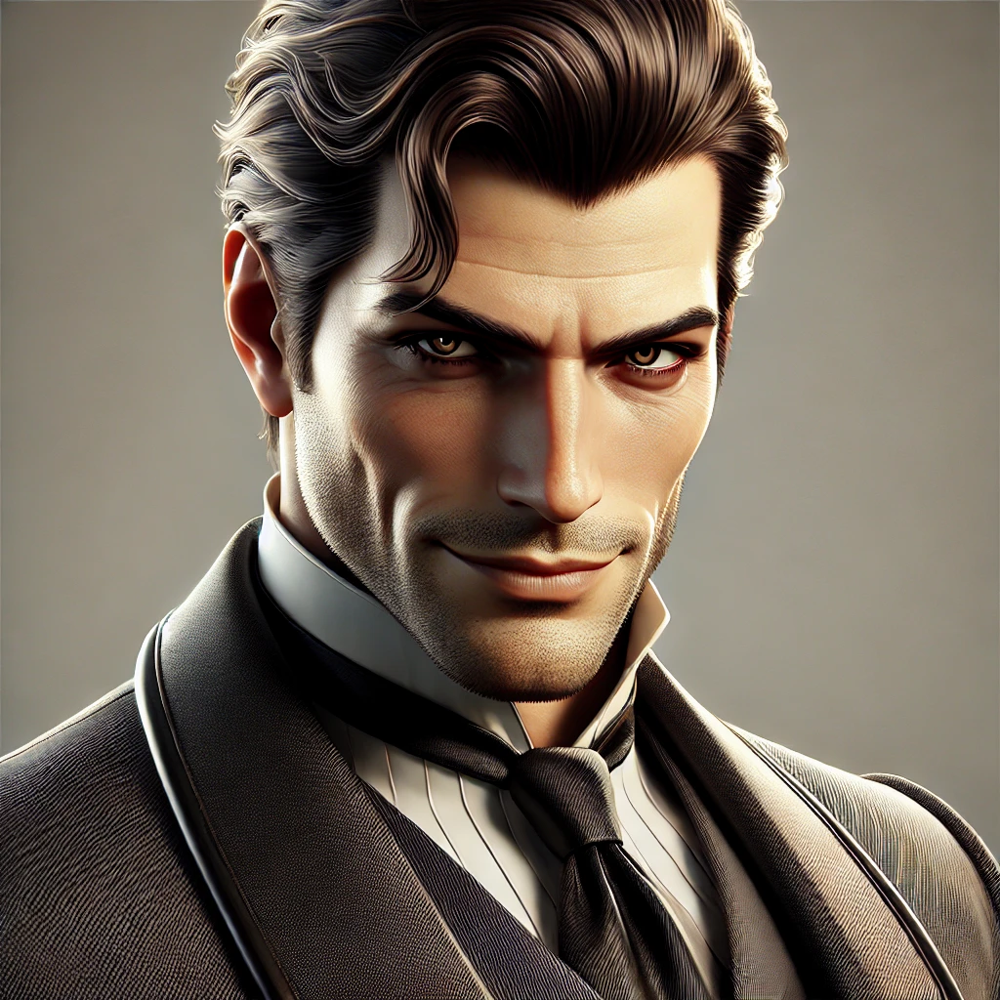
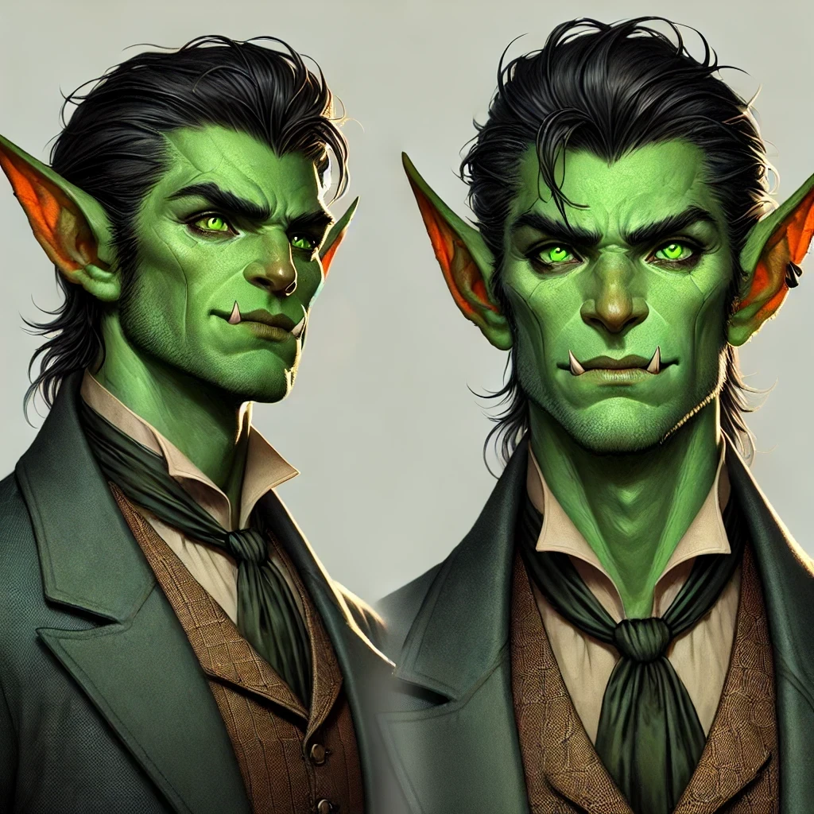

# Eron Vosk

| | |
|---|---|
| **Role** | Primary Antagonist |
| **Pre-Transition** | Super Billionaire |
| **Class** | Mind Mage |
| **Race** | Goblin (forced) |
| **Age** | 48 |
| **Post-Transition Title** | Goblin Warlord |

An imposing antagonist with piercing eyes that seem to hold secrets and a charismatic smile concealing sinister intentions beneath a veneer of sophistication.

Eron Vosk is the primary antagonist of Book I. A powerful billionaire with significant resources, he learned of the simulation discovery through Dan and immediately moved to control it.

## Pre-Transition

Eron commanded significant resources including:
- Armed mercenary teams
- Surveillance capabilities (tracked the party via their tablets)
- Connections to powerful people in government and industry

**Key Actions**:
- Received intelligence from Dan about the discovery
- Deployed armed teams to capture the party at the safehouse
- Captured and tortured [Wade](../party/wade.md) to extract information
- Confronted the party outside iQuantum HQ with armed forces and snipers

His goal was to control access to the simulation's power for personal wealth and dominance.

## The Transition

During the final moments before the Transition, [Clint](../party/clint.md) reached the quantum computer and made several changes. One was **specifically targeted at Eron**:

> Clint changed Eron's race to **Goblin**

This was not random—it was deliberate punishment. Eron did not choose to become a Goblin; it was forced upon him by Clint as a final act before triggering the world template change.

## Post-Transition

Despite being forcibly transformed into a Goblin, Eron adapted quickly:
- Became a **Level 25 Goblin Warlord**
- Controls a **Goblin Fortress**
- Retained his Mind Mage abilities
- Commands goblin forces

As a Level 25 boss, Eron serves as the final antagonist of Book I (which covers party levels 1-20). His fortress represents a significant threat, and his vendetta against Clint and the party is deeply personal.

*Eron will return in future books at higher levels.*

## Abilities

As a [Mind Mage](../../classes/mind-mage.md), Eron specializes in:
- Charm and domination magic
- Mental manipulation
- Coercion and control

## Relationships

- Allied with [Dan](dan.md) ([Necromancer](../../classes/necromancer.md) [Troll](../../races/troll.md))
- Personal vendetta against Clint (who transformed him)
- Enemy of the main party
